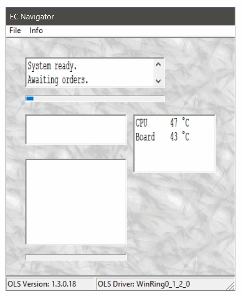

#	EC Navigator

EC Navigator is an Embedded Controller viewer and hardware resource monitoring.  
It allows to explore the EC of (old) PC and retrieve useful informations such as temperatures, fan speeds, batteries charges and so on. 
Some laptop models configurations are already included but it is possible to add custom configurations for unsupported machine. 
It is easy to compile with the mingwu gcc compiler. 
Just download the program and unpack it in your favourite folder (es: c:\myapps), then download the compiler and unpack it in the same folder (es: c:\myapps).
Finally, use the batch file you can find in the source folder (es: c:\myapps\ECNavigator\src) to create your own compilation.  
In order to run EC Navigator is necessary to have administrator rights which are required to load the drivers it uses. It works fine under Windows XP, Vista .. Windows 10.  
I hope you enjoy it.

  

  
